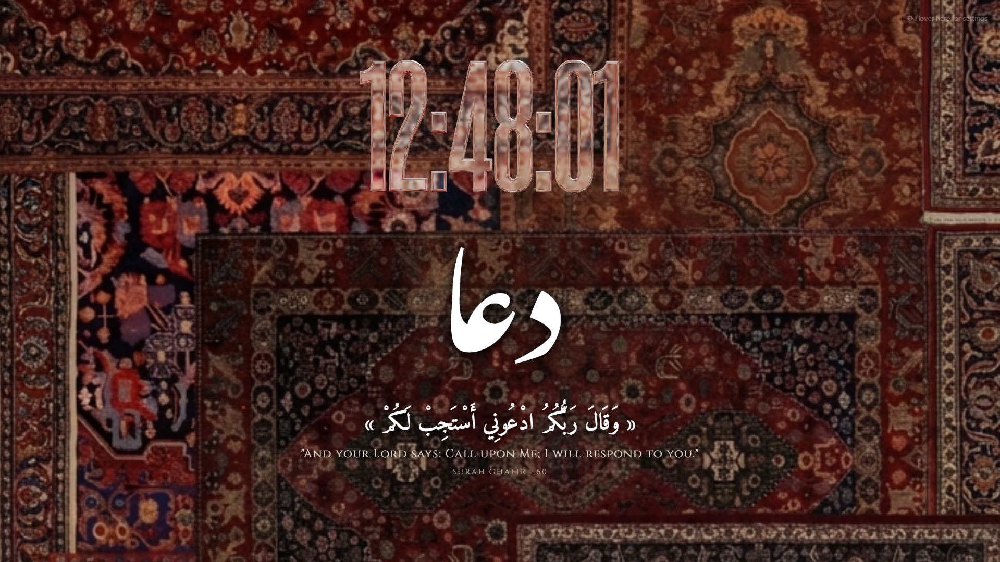
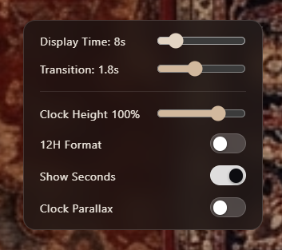
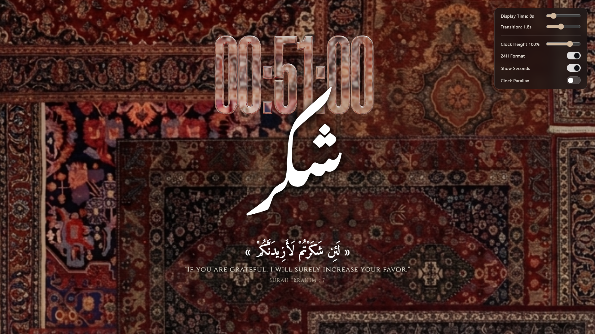

# Islamic Minimal Live Wallpaper (with Liquid Glass Clock)

A beautiful, minimalistic Islamic live wallpaper built with HTML, CSS, JavaScript, and Three.js. It features elegant Arabic calligraphy along with a dynamic, highly customizable 3D liquid glass clock effect.

---

## 📸 Screenshots

*(Replace these placeholder images with actual screenshots from your wallpaper!)*

**Main Overview**

*The default view displaying the floating 3D clock and the animated Islamic verses.*

**Unified Settings Panel**

*Hovering in the top right reveals the unified control panel to adjust both text and clock settings.*

**Clock with Seconds & 12H Format**

*Showcasing the clock with seconds toggled on and the 24H format turned off.*

---

## 🌟 Detailed Overview & Features

This live wallpaper elegantly merges two primary components:

### 1. Spiritual Words & Quranic Verses
- **Dynamic Content**: Cycles through beautiful Urdu calligraphy of spiritual concepts (like Tawakkul, Sabr, Shukr, Ridha, and Dua).
- **Translations & References**: Displays the corresponding Quranic Arabic verses, English translations, and Surah references.
- **Ink Reveal Animations**: Smooth, elegant CSS-based ink draw-in and dissolve transitions.
- **Adjustable Timings**: You can tweak the display duration and transition speed to your liking.

### 2. 3D Liquid Glass Clock (Three.js)
- **Glass Refraction**: The clock numerals are rendered as physical 3D objects with a liquid glass material. As the clock moves (or as you move your mouse), the glass beautifully refracts the warm background behind it.
- **Mouse Parallax**: The background and the lighting react dynamically to your mouse cursor's movement.
- **Fully Customizable UI**: 
  - **Clock Height**: Adjust how high or low the clock floats in the upper region.
  - **24H Format**: Switch between 12-hour and 24-hour time.
  - **Show Seconds**: Toggle the display of seconds on the clock.
  - **Parallax Toggle**: Enable or disable the mouse-tracking 3D effect.

---

## ⚙️ How to Use

### 1. Installation (Lively Wallpaper)
This wallpaper is designed to run locally, making it perfect for desktop customization software like **Lively Wallpaper** on Windows.
1. Download or clone this folder (`Live Wallpaper`).
2. Open Lively Wallpaper.
3. Drag and drop the `index.html` file into the Lively Wallpaper interface, or click **"Add Wallpaper"** and point it to the folder.
4. Set it as your active wallpaper!

### 2. Using the Settings Panel
All customizations are done live without needing to edit the code.
- **Accessing Settings**: Simply move your mouse to the **top-right corner** of your screen. A frosted-glass settings panel will fade into view.
- **Text Controls**: Use the top two sliders to control how long each verse stays on screen, and how fast the ink-reveal transition takes.
- **Clock Controls**: Use the bottom sliders and iOS-style toggle switches to customize the 3D clock's height, time format, and parallax effects.
- **Saving**: Because it's a live web-based wallpaper, settings will apply instantly but will reset to defaults when Lively Wallpaper restarts. You can easily tweak the default values directly in the `index.html` code if you want permanent changes.

---

## 💻 Technologies Used

- **HTML5 & CSS3**: Glassmorphism, CSS Variables, Flexbox, Keyframe Animations, Filters.
- **Vanilla JavaScript**: DOM manipulation, interval loops.
- **Three.js**: Custom WebGL shaders, PMREM environment mapping, `MeshPhysicalMaterial` for the liquid glass transmission and iridescence.
- **Google Fonts**: `Amiri`, `Cinzel`, `Noto Nastaliq Urdu`.